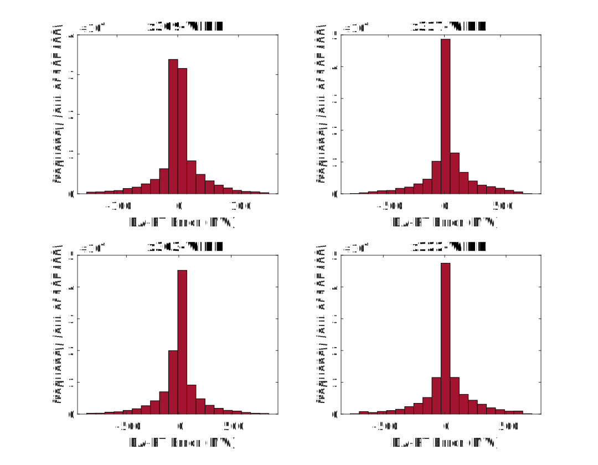
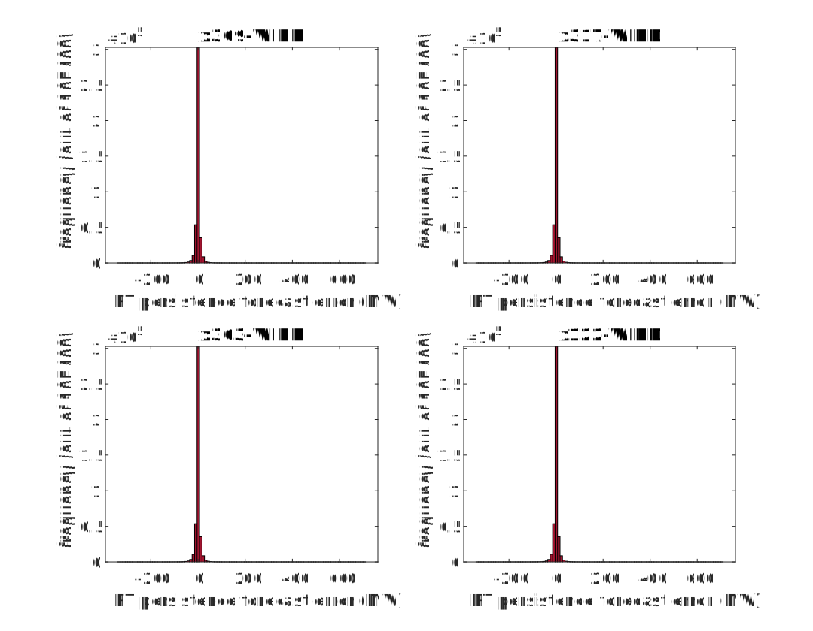

## Wind Data

Based on the Matlab script [analyze_wind.m](analyze_wind.m)

### Basic Info
- 4 Wind Farms in the RTS-GMLC system, named 'x309-WIND','x317-WIND', 'x303-WIND' and 'x122-WIND'.
- 2 sets of data available: day-ahead (1-hour resolution, 366 days, 8784 points) and real-time (5-min resolution, 366 days, 105408 points)

Wind Profiles (4 Time Series)

### Forecast Error
#### DA minus RT Error
- We calculate the differences between day-ahead and real-time time series, i.e. DA minus RT (DA-RT) error.
- DA and RT series have different resolution, for each hour, DA has 1 point but RT has 12 points (5 min each). We first transform DA to be a 5-min resolution series DA' by repeat the same value 12 times, then calculate errors as DA' - RT, which has 12 points for each hour.

- Q: What does the distribution of DA-RT errors look like?
- A: The histogram of DA-RT errors:
  

- Q: Is the DA-RT Error of a wind farm independent of others?
- A: We provide the pairwise plot (`plotmatrix()` in Matlab, `pair()` in R):
  
  Correlation coefficients and p-values are calculated in the Matlab script.

#### Persistence Forecast Error

- Persistence forecast is a forecast that the future condition will be the same as the present condition, i.e. forecast[t+1] = wind[t]

- Q: What does the distribution of DA persistence forecast errors look like?
- A: Day-ahead Persistence Forecast MW Error Histogram:
  

- Q: Is the DA persistence forecast of a wind farm independent of others?
- A: We provide the pairwise plot (`plotmatrix()` in Matlab, `pair()` in R):
  
  Correlation coefficients and p-values are calculated in the Matlab script.

- Q: What does the distribution of RT persistence forecast errors look like?
- A: Real-time Persistence Forecast MW Error Histogram:
  

- Q: Is the RT persistence forecast of a wind farm independent of others?
- A: We provide the pairwise plot (`plotmatrix()` in Matlab, `pair()` in R):
  
  Correlation coefficients and p-values are calculated in the Matlab script.

